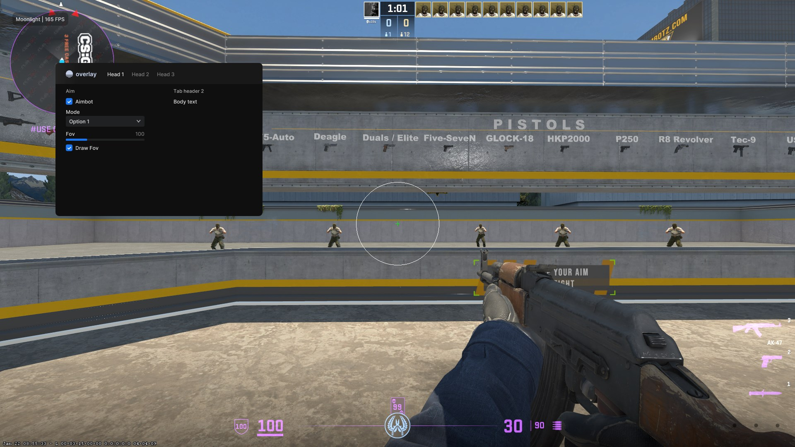

<div align="center">
    
    <H3>dx9 imgui template </H3>
    <p> 
        <a href="https://github.com/majvax/dx9-imgui-template/stargazers"></a>
        <a href="https://github.com/majvax/dx9-imgui-template/issues"></a>
        <a href="https://github.com/majvax/dx9-imgui-template/contributors"></a>
    </p>    
</div>

> [!NOTE]
> Please pull any request if you want me to add something

<details>
    <summary>Table of Contents</summary>
    <ol>
        <li><a href="#description">Description</a></li>
        <li><a href="#preview">Preview</a></li>
        <li>
            <a href="#getting-started">Getting Started</a>
            <ul>
                <li><a href="#installation">Installation</a></li>
            </ul>
        </li>
    </ol>
</details>

<hr>

<div align="center" id="preview">
    <H3>Description 📸</H3>
    <h6>Easily create a directx9 overlay with with an ImGui menu. Come with a beautiful ImGui Menu built-in.<H6>
</div>

<hr>


<div align="center" id="preview">
    <H3>Preview 📸</H3>
    
</div>
<hr>
<div align="center" id="installation">
    <H3>Installation 💾</H3>

<div align="left">
<H6>Install from source</H6>


```
git clone https://github.com/majvax/dx9-imgui-template.git
open the .sln file in the dx9-imgui-template folder
and change anything you want
```

</div>
</div>
<hr>


